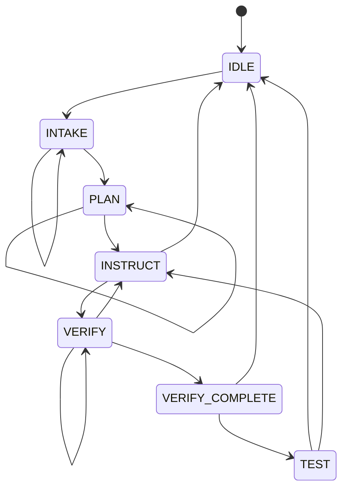

# Circuit-Sensei Full-Stack Testing Handoff

This guide is for teammates, reviewers, and AI agents that need to run
Circuit-Sensei from the beginning of a real circuit build through final Arduino
validation.

Circuit-Sensei is currently a Python CLI-driven prototype. The "full stack" for
the circuit workflow is:

1. User gives a circuit goal and available components.
2. Gemini plans the circuit and breadboard placements.
3. Circuit-Sensei draws visual guidance to `/tmp/sensei_annotated.jpg`.
4. The user physically places the component or jumper.
5. The webcam captures `/tmp/sensei_frame.jpg`.
6. Gemini Vision checks the real board image.
7. After all visual checks pass, Circuit-Sensei connects to the Arduino over USB
   serial.
8. Circuit-Sensei runs a test script and reports measurements.

There is also a frontend app under `frontend/`, but the real hardware circuit
workflow described here is run through `python -m circuit_sensei.main`.

## Repo Map

```text
CircuitSensei/
|-- circuit_sensei/
|   |-- main.py                         # CLI entry point
|   |-- agent.py                        # state machine, Gemini loop, plan repair
|   |-- tools.py                        # tool registry: camera, annotation, vision, Arduino
|   |-- hardware/
|   |   |-- camera.py                   # OpenCV camera capture and reference frame generation
|   |   |-- overlay.py                  # breadboard geometry and annotation renderer
|   |   `-- arduino_tester.py           # JSON-over-serial Arduino client
|   |-- prompts/
|   |   `-- system_prompt.py            # Gemini operating rules
|   `-- arduino/
|       `-- circuit_tester.ino          # Arduino firmware for measurements
|-- scripts/
|   `-- arduino_smoke_test.py           # low-risk Arduino serial smoke test
|-- tests/                              # Python unit tests
|-- config.yaml                         # real hardware, camera, overlay, geometry config
|-- requirements.txt                    # Python dependencies
`-- frontend/                           # Vite React UI prototype
```

## Hardware And Software Requirements

Hardware:

- Computer with Python 3.11 or newer.
- Webcam mounted top-down over the breadboard.
- Arduino connected by USB.
- Breadboard, jumper wires, and components for the chosen circuit.
- Arduino flashed with `circuit_sensei/arduino/circuit_tester.ino`.

Software:

- Python dependencies from `requirements.txt`.
- `GEMINI_API_KEY` in the shell environment for real mode.
- OpenCV camera access permission on macOS.
- Arduino serial port configured in `config.yaml`.

Install dependencies:

```bash
cd /Users/johnpeng/Documents/CircuitSensei
python3.11 -m venv .venv
source .venv/bin/activate
pip install -r requirements.txt
```

If you are using an existing Python environment, the important packages are
`google-genai`, `rich`, `PyYAML`, `opencv-python`, `numpy`, `pyserial`, `pillow`,
and `pytest`.

Set the Gemini key before running real hardware mode:

```bash
export GEMINI_API_KEY="your-key-here"
```

## Configuration Checklist

Open `config.yaml` before testing.

Important real-mode settings:

```yaml
hardware:
  mock_mode: false
  camera_index: 0
  serial_port: auto
  baud_rate: 115200
  serial_timeout_seconds: 2.0

camera:
  backend: avfoundation
  warmup_frames: 25
  warmup_delay_seconds: 0.04
  auto_enhance: true
  dark_threshold: 85.0
  target_brightness: 135.0

overlay:
  annotation_source: reference

paths:
  frame_path: /tmp/sensei_frame.jpg
  annotated_path: /tmp/sensei_annotated.jpg
```

Notes:

- `hardware.mock_mode: false` is required for the real workflow.
- `hardware.serial_port: auto` detects common Arduino, CH340, CP210x, and FTDI
  USB serial ports.
- On macOS, Arduino ports usually look like `/dev/cu.usbmodem21301` or
  `/dev/cu.usbserial-*`; set one explicitly only if autodetection chooses the
  wrong device.
- `camera.backend: avfoundation` usually works best on macOS.
- `overlay.annotation_source: reference` means guidance is drawn on a generated
  breadboard diagram. Set it to `camera` if you want guidance drawn over the live
  camera frame instead.

List available serial ports:

```bash
ls /dev/cu.* /dev/tty.*
```

## Before The Full Test

Run these quick checks first.

Check the Python test suite:

```bash
python -m pytest
```

Expected result:

```text
All tests pass.
```

Check one real camera capture:

```bash
python -m circuit_sensei.main --real --capture-test
open /tmp/sensei_frame.jpg
```

Expected result:

- Command exits with status `0`.
- JSON includes `"ok": true`.
- `/tmp/sensei_frame.jpg` is a usable 1280x720 webcam image.
- If the image is dark, the JSON may show `"enhanced": true`.

Check Arduino serial without driving outputs:

```bash
python scripts/arduino_smoke_test.py
```

Expected result:

```text
connect: {"message": "Arduino connected.", "mock": false, "ok": true, ...}
read_analog_A0: {"status": "ok", "unit": "V", "value": ...}
read_digital_2: {"status": "ok", "value": ...}
button_test: {"status": "ok", ...}
```

To force a specific port:

```bash
python scripts/arduino_smoke_test.py --port /dev/cu.YOUR_PORT
```

## Full Real Circuit Test

Use this command for a real LED circuit test:

```bash
python -m circuit_sensei.main --real \
  --goal "build and test a simple LED circuit driven from Arduino pin D9" \
  --inventory "Arduino Uno, breadboard, LED, 330 ohm resistor, jumper wires"
```

Important: do not use `--mock` for the real test.

The app will print a panel like:

```text
Circuit-Sensei is ready.
Commands: /next to continue, /confirm to manually accept a step, /state to inspect state, /quit to exit.
Guidance is drawn on-screen over webcam frames; no LED strips are used.
```

Because the command includes `--goal` and `--inventory`, the first Gemini turn
should already know what to build. If you start without those flags, type the
goal and inventory manually:

```text
Goal: build and test a simple LED circuit driven from Arduino pin D9
Inventory: Arduino Uno, breadboard, LED, 330 ohm resistor, jumper wires
```

### How To Drive The Interactive Session

The main commands are:

```text
/next       Continue to the next action or retry the current checkpoint.
/confirm    Manually accept the current physical placement while in VERIFY.
/state      Print the current session state JSON.
/quit       Exit.
```

Typical full session:

1. Start the program with `--real`, `--goal`, and `--inventory`.
2. If the app asks for goal/components, paste the goal and inventory text.
3. Type `/next` until Circuit-Sensei shows the first annotated build step.
4. Open or view `/tmp/sensei_annotated.jpg`.
5. Physically place exactly the component or jumper requested.
6. Type `/next`.
7. Circuit-Sensei captures `/tmp/sensei_frame.jpg` and sends it to Gemini Vision.
8. If Gemini Vision passes, type `/next` to receive the next annotated step.
9. Repeat until all visual build steps pass.
10. Type `/next` when prompted to move into Arduino testing.
11. Circuit-Sensei connects to the Arduino and reports the test result.

The annotated image is always written to:

```text
/tmp/sensei_annotated.jpg
```

The latest camera verification frame is always written to:

```text
/tmp/sensei_frame.jpg
```

On macOS, open them with:

```bash
open /tmp/sensei_annotated.jpg
open /tmp/sensei_frame.jpg
```

### Example Human Transcript

This is the intended rhythm. The exact Gemini wording and locations can vary.

```text
Circuit-Sensei:
Great. I have the goal and inventory. I will derive a compact breadboard plan next.

You:
/next

Circuit-Sensei:
Placement plan:
1. With power disconnected, place the current-limit resistor from A10 to A20.
2. Place the LED anode at E20 and cathode at E25.
3. With Arduino outputs still inactive, connect D9 to column 10 and GND to column 25.

You:
/next

Circuit-Sensei:
With power disconnected, place the current-limit resistor from A10 to A20.
Annotated guidance saved to /tmp/sensei_annotated.jpg.
After placing it, press /next for Gemini Vision verification.

Human action:
Place the resistor exactly as instructed.

You:
/next

Circuit-Sensei:
Gemini Vision check passed. Press /next for the next annotated build step.

You:
/next

Circuit-Sensei:
Place the LED anode at E20 and cathode at E25.
Annotated guidance saved to /tmp/sensei_annotated.jpg.

Human action:
Place the LED. Check polarity carefully.

You:
/next

Circuit-Sensei:
Gemini Vision check passed. Press /next for the next annotated build step.

You:
/next

Circuit-Sensei:
With Arduino outputs still inactive, connect D9 to column 10 and GND to column 25.

Human action:
Connect Arduino D9 and GND as instructed.

You:
/next

Circuit-Sensei:
Gemini Vision check passed. All build steps are visually verified.

You:
/next

Circuit-Sensei:
All visual build steps are verified. I will now run the Arduino-side validation.

You:
/next

Circuit-Sensei:
Arduino test result: PASS
Test type: led
Measurements: {"drive_pin": "D9", "sense_voltage": ...}
Circuit-Sensei is back at IDLE.
```

## What To Type If Something Goes Wrong

If the camera or Gemini cannot verify a placement, but a human has checked the
board carefully:

```text
/confirm
```

Only use `/confirm` while the app is waiting in `VERIFY`.

If you want to inspect the state machine:

```text
/state
```

Useful fields:

- `current_state`: current workflow state.
- `circuit_goal`: captured goal.
- `inventory`: captured component list.
- `placement_plan`: planned build steps.
- `current_step`: 1-based step number shown to the user.
- `verified_steps`: steps that passed Gemini Vision or manual confirmation.
- `arduino_connected`: whether serial connect has succeeded.
- `arduino_port`: configured or connected Arduino port.
- `plan_repairs`: automatic repairs made to avoid duplicate breadboard holes.

If a component smokes, gets hot, burns, melts, or smells wrong, type what
happened. The emergency handler should respond with:

```text
⚠️ DISCONNECT POWER NOW
```

Regardless of software output, disconnect USB/power immediately.

## Supported Example Goals

The default deterministic fallback plans support:

- LED circuit: any goal mentioning an LED or otherwise not matching the special
  cases.
- Voltage divider: goals containing `divider`.
- Button test: testing logic exists for goals containing `button`, but the
  fallback physical plan is currently strongest for LED and divider workflows.

Recommended real end-to-end goal:

```text
build and test a simple LED circuit driven from Arduino pin D9
```

Recommended inventory:

```text
Arduino Uno, breadboard, LED, 330 ohm resistor, jumper wires
```

Recommended voltage divider goal:

```text
build and test a 2-resistor voltage divider measured by Arduino A0
```

Recommended inventory:

```text
Arduino Uno, breadboard, two 10k resistors, jumper wires
```

## Under The Hood

### State Machine

Circuit-Sensei uses a finite state machine in `circuit_sensei/agent.py`.



State meanings:

- `IDLE`: waiting for a new circuit goal.
- `INTAKE`: gathering goal and component inventory.
- `PLAN`: deriving circuit logic and breadboard placement plan.
- `INSTRUCT`: creating visual annotation for one physical build step.
- `VERIFY`: capturing a webcam image and asking Gemini Vision to verify it.
- `VERIFY_COMPLETE`: all visual checks passed; Arduino testing can start.
- `TEST`: Arduino serial stimulation and measurement.

The model must append a state block to normal responses:

```text
%%STATE%%
{"next_state": "PLAN", "reason": "inventory confirmed"}
%%END%%
```

Plans are carried in a JSON block:

```text
%%PLAN_JSON%%
[
  {
    "step": 1,
    "instruction": "With power disconnected, place the resistor from A10 to A20.",
    "verification": "Verify the resistor bridges A10 and A20.",
    "annotations": {
      "points": [
        {"row": "A", "col": 10, "label": "resistor leg 1"},
        {"row": "A", "col": 20, "label": "resistor leg 2"}
      ],
      "arrows": [
        {
          "from": {"row": "A", "col": 10},
          "to": {"row": "A", "col": 20},
          "label": "resistor"
        }
      ],
      "message": "Place the resistor between A10 and A20."
    }
  }
]
%%ENDPLAN_JSON%%
```

If Gemini skips a plan or returns an invalid transition, the host code repairs
common mistakes and can synthesize a built-in fallback plan.

### Tool Flow

The tool layer lives in `circuit_sensei/tools.py`.

Available tools:

- `capture_frame`: captures the webcam image to `/tmp/sensei_frame.jpg`.
- `annotate_frame`: draws breadboard guidance to `/tmp/sensei_annotated.jpg`.
- `show_annotated_frame`: prints where the annotated frame was saved.
- `analyze_board`: sends the captured frame to Gemini Vision.
- `arduino_connect`: opens the configured serial port.
- `arduino_send_command`: sends one JSON command to the Arduino.
- `run_test_script`: runs a named validation routine.
- `alert_user`: prints an important Rich panel.

Tools are restricted by state. For example, Arduino tools are not allowed during
planning or visual instruction. This prevents the app from energizing outputs
before the visual build has passed.

### Camera Capture

`CameraCapture` in `circuit_sensei/hardware/camera.py` handles real webcam
capture.

Real capture flow:

1. Open camera with the configured backend.
2. Apply width, height, brightness, contrast, exposure, and gain if configured.
3. Read warmup frames to let auto-exposure settle.
4. Compute mean brightness.
5. Optionally enhance dark frames.
6. Save the frame to `/tmp/sensei_frame.jpg`.

If `overlay.annotation_source` is `reference`, instruction images are drawn on a
generated clean breadboard reference. If it is `camera`, Circuit-Sensei captures
a live frame before annotation.

### Visual Verification

`GeminiVisionAnalyzer` in `circuit_sensei/tools.py` sends the current image to
Gemini Vision with a verification instruction. In real mode it requires
`GEMINI_API_KEY`.

The current pass/fail detection is intentionally simple:

- If Gemini text contains `false` or `fail`, Circuit-Sensei treats it as not
  passed.
- Otherwise, it treats the visual check as passed.

This means prompts and Gemini output format matter. If Vision is uncertain, use
`/next` to retry after improving the camera view, or `/confirm` only after a
human has checked the placement.

### Breadboard Topology And Plan Repair

The agent understands basic solderless breadboard topology:

- `A-E` in the same numbered column are electrically connected.
- `F-J` in the same numbered column are electrically connected.
- The center gap separates `E` from `F`.
- One physical hole can hold only one lead or jumper end.

`validate_and_repair_plan()` repairs exact-hole reuse when possible. For
example, if a plan tries to put two leads in `B15`, the second lead can be moved
to another electrically equivalent free hole such as `C15`, `D15`, `E15`, or
`A15`.

Repairs are recorded in session state as `plan_repairs` and displayed to the
user if needed.

### Arduino Serial Protocol

The Arduino firmware is `circuit_sensei/arduino/circuit_tester.ino`.

Serial settings:

```text
115200 baud
one JSON-like command per line
```

Examples:

```json
{"cmd":"read_analog","pin":0}
{"cmd":"read_digital","pin":2}
{"cmd":"set_digital","pin":9,"value":1}
{"cmd":"set_pwm","pin":9,"value":128}
{"cmd":"run_test","test_type":"led","drive_pin":9,"sense_pin":"A0"}
```

The Python side sends uppercase command names such as `READ_ANALOG`, then
normalizes them into the firmware's lowercase wire format. A pin like `A0` is
converted to analog channel `0` for direct `READ_ANALOG` commands.

Built-in Python test scripts in `ArduinoTester.run_test_script()`:

- `led`: sets D9 high, reads A0, then sets D9 low.
- `voltage_divider`: reads A0 and checks the measured voltage against expected
  voltage and tolerance.
- `button`: reads digital pin 2.

The final CLI result looks like:

```text
Arduino test result: PASS

Test type: led
Measurements: {"drive_pin": "D9", "sense_voltage": 1.92}

Circuit-Sensei is back at IDLE. Start a new goal when you are ready.
```

## Troubleshooting

### `GEMINI_API_KEY is missing`

Real mode requires the key:

```bash
export GEMINI_API_KEY="your-key-here"
```

Then rerun the command. Do not add `--mock` if you are testing the real stack.

### Camera Does Not Open

Symptoms:

```text
Webcam index 0 could not be opened.
```

Try:

- Close other apps using the webcam.
- Check macOS camera permissions.
- Change `hardware.camera_index` in `config.yaml`.
- Try `camera.backend: auto` instead of `avfoundation`.
- Run:

```bash
python -m circuit_sensei.main --real --capture-test
```

### Camera Image Is Too Dark

Try:

- Add more light.
- Increase `camera.warmup_frames`.
- Increase `camera.target_brightness`.
- Confirm `camera.auto_enhance: true`.

Then rerun:

```bash
python -m circuit_sensei.main --real --capture-test
open /tmp/sensei_frame.jpg
```

### Arduino Cannot Connect

Symptoms:

```text
No Arduino serial port detected.
```

Try:

- Unplug/replug the Arduino.
- Close Arduino IDE Serial Monitor.
- Run `ls /dev/cu.*`.
- Leave `hardware.serial_port: auto`, or set it explicitly in `config.yaml` if
  multiple matching boards are attached.
- Flash `circuit_sensei/arduino/circuit_tester.ino`.
- Run:

```bash
python scripts/arduino_smoke_test.py
```

### Gemini Vision Rejects A Correct Placement

Try:

- Improve lighting.
- Make sure the breadboard fills the camera view.
- Open `/tmp/sensei_frame.jpg` and inspect what Gemini sees.
- Press `/next` to retry.
- Use `/confirm` only if a human checked the placement against the instruction.

### The Annotated Image Does Not Match The Real Breadboard

Check `config.yaml`:

```yaml
breadboard:
  image_size: [1280, 720]
  orientation: standard
  top_left: [650, 140]
  bottom_right: [1095, 650]
  rows: ["A", "B", "C", "D", "E", "F", "G", "H", "I", "J"]
  columns: 30
```

The configured coordinates define the breadboard grid used by the annotation
renderer. If using camera overlay mode, calibrate `top_left` and `bottom_right`
against the actual camera frame.

## Notes For AI Agents

When operating this repo:

- Prefer the real full-stack command with `--real`; do not silently switch to
  `--mock`.
- Before a real run, check `GEMINI_API_KEY`, camera capture, and Arduino serial.
- In the interactive program, use `/next` to advance.
- Do not type arbitrary text while in `VERIFY` unless asking a question. Normal
  text in `VERIFY` is treated as conversation and does not retry Vision.
- Use `/confirm` only when a human explicitly says the physical placement was
  checked.
- Do not proceed to Arduino testing until the app reaches `VERIFY_COMPLETE`.
- Do not edit `config.yaml` unless the user asks or the hardware port/camera
  index is known to be wrong.
- If hardware is missing, report the exact blocker instead of substituting mock
  mode.

Recommended real run command:

```bash
python -m circuit_sensei.main --real \
  --goal "build and test a simple LED circuit driven from Arduino pin D9" \
  --inventory "Arduino Uno, breadboard, LED, 330 ohm resistor, jumper wires"
```

Recommended preflight commands:

```bash
python -m pytest
python -m circuit_sensei.main --real --capture-test
python scripts/arduino_smoke_test.py
```
